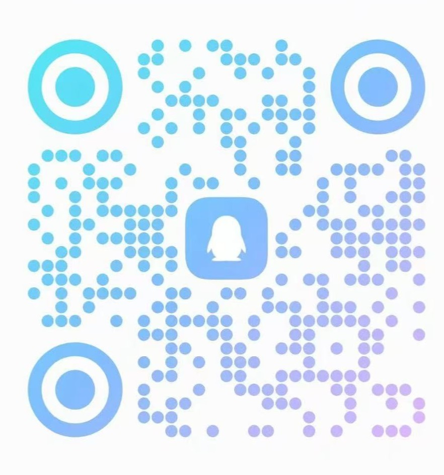

<div align="center">
  
  <p>
    <a href="LICENSE"></a>
    <a href=""></a>
  </p>

  <p>
    <strong>Juntao Jiang</strong>,
    <strong>Jinsheng Bai</strong>,
    <strong>Linxuan Fan</strong>,
     <strong>Yali Bi</strong>,
    <strong>Jiangning Zhang</strong>,
    <strong>Yong Liu</strong>
  </p>

  <p>
    <a href="README.md">English</a>
  </p>
</div>

> **132** 完整网络 · **178** 编码器 · **45** 解码器 · **89** 损失函数 · **25** 跳跃连接 · **17** 瓶颈层 · **6** 大训练范式 · **24** 种数据增强 · **921** YAML 配置 · 一行 YAML 完成切换

---

## 📰 更新日志

- **2026.06.15** — 项目正式更名为 **APRIL-MedSeg**，取自浙江大学 [APRIL 实验室](https://april.zju.edu.cn/)（刘勇教授团队）。
- **2026.06.11** — **UltimateMedSeg** 正式发布！

---

## 📑 目录

- [更新日志](#更新日志)
- [安装](#安装)
- [快速开始](#快速开始)
- [教程](#教程)
- [项目结构](#项目结构)
- [模型组件](#模型组件)
- [训练范式](#训练范式)
- [部署与效率](#部署与效率)
- [数据集](#数据集)
- [配置系统](#配置系统)
- [自定义扩展](#自定义扩展)
- [引用与许可](#引用与许可)
- [联系我们](#联系我们)
- [交流群](#交流群)
---
<a id="安装"></a>
## 📦 安装

### 环境要求

- Python >= 3.10
- PyTorch >= 2.0
- NVIDIA GPU + CUDA 12.4+

### 基础安装

```bash
git clone https://github.com/juntaoJianggavin/APRIL-MedSeg.git
cd APRIL-MedSeg

# 安装依赖
pip install -r requirements.txt

# 开发模式安装
pip install -e .
```

### 可选依赖

```bash
# Foundation 模型
pip install transformers safetensors

# MLLM 推理 pipeline
pip install groundingdino-py
pip install git+https://github.com/facebookresearch/segment-anything.git

# ONNX 导出与验证
pip install onnx onnxruntime

# Lion 优化器
pip install lion-pytorch

# Mamba / SSM 编码器（仅 Mamba 系列网络需要，需 CUDA 工具链编译）
pip install causal-conv1d
pip install mamba-ssm
```

### 预训练权重与迁移学习

三个层级的权重加载，从轻量到重量：

| 方式 | YAML 配置项 | 加载范围 | 使用场景 |
|---|---|---|---|
| 编码器预训练 | `encoder.pretrained: true` | 仅骨干网络 | ImageNet / 领域特定骨干权重 |
| 手动指定路径 | `encoder.pretrained_path: /path/to/weights.pth` | 仅骨干网络 | 离线环境 / 自定义骨干检查点 |
| 迁移学习 | `model.transfer_learning_path: /path/to/full_model.pth` | 整个网络 | 从之前的训练运行中加载完整模型（encoder+decoder+bottleneck+head） |

```yaml
model:
  # 完整模型迁移学习（在 encoder pretrained 之后加载，优先级更高）
  transfer_learning_path: null  # 或 /path/to/checkpoint.pth

  encoder:
    name: timm_resnet50
    pretrained: true              # 自动下载 ImageNet 骨干权重
    pretrained_path: null         # 或 /path/to/backbone.pth（手动覆盖）
```

> **说明**：需要特定预训练权重的模型（`REQUIRES_PRETRAINED` 中的 **43** 个架构）在设置 `pretrained: false` 时会显示 10 秒倒计时警告。所有可自动下载的权重都支持通过 `pretrained_path` 或 `transfer_learning_path` 手动指定本地路径。

#### 预训练权重来源（3 类）

| 类别 | 加载机制 | 模型 |
|---|---|---|
| **A. WEIGHT_REGISTRY 自动下载** | `ensure_weight()` 从 GitHub/GCS/HF 下载 | swinunet, h2former, hiformer, transunet, vm_unet, rwkv_unet (B/S/T), cswin_unet, da_transunet, mamba_unet, fcbformer, transnuseg |
| **B. timm / torchvision 运行时** | `pretrained: true` 触发内置下载 | segformer_b0–b5, esfpnet, cascade, emcad, polyp_pvt, fatnet, transfuse, mist, hsnet, ssformer, ldnet, dconnnet, cfanet, lv_unet, nulite, polyper |
| **C. SAM 家族** | `pretrained: true` 自动下载 ViT/SAM 权重 | sam_b, sam_l, mobile_sam, sam2, sam_med2d, samed, samus, auto_sam, lite_medsam, medical_sam_adapter |

### 预训练权重自动下载

```bash
# 列出所有已注册权重及缓存状态
python -m medseg.utils.weight_downloader list

# 下载指定权重（自动重试所有源）
python -m medseg.utils.weight_downloader download medsam_vit_b

# 检查哪些可自动下载的权重已存在
python -m medseg.utils.weight_downloader check
```

当所有自动下载源都失败时，错误信息会包含：
- 手动下载 URL
- 文件应放置的精确缓存路径
- 替代方案：在 YAML 中设置 `pretrained_path` 指向本地文件

timm 编码器权重通过 timm 内置机制自动下载。

---
<a id="快速开始"></a>
## 🚀 快速开始

### 1. 标准监督训练

```bash
# ResNet50 + UNet decoder
python train.py --config configs/architectures/networks/general/aau_net.yaml \
    --output_dir output/aau_net

# 使用 AMP 混合精度
python train.py --config configs/architectures/networks/general/transunet.yaml \
    --output_dir output/transunet --amp

# 多卡 DDP 训练
torchrun --nproc_per_node=4 train.py \
    --config configs/architectures/networks/general/swinunet.yaml \
    --output_dir output/swinunet --amp
```

### 2. 推理 / 测试

```bash
# 单模型评估
python test.py --config configs/architectures/networks/general/transunet.yaml \
    --checkpoint output/best_model.pth

# 保存预测结果
python test.py --config configs/architectures/networks/general/transunet.yaml \
    --checkpoint output/best_model.pth --save_pred --output_dir test_output/

# 多 checkpoint 集成（logit 平均）
python test.py --config configs/architectures/networks/general/transunet.yaml \
    --checkpoint ckpt_a.pth ckpt_b.pth ckpt_c.pth \
    --ensemble-weights 0.5 0.3 0.2 \
    --ensemble-average logit

# 测试时增强（TTA）
python test.py --config configs/architectures/networks/general/transunet.yaml \
    --checkpoint output/best_model.pth \
    --tta \
    --tta-augs identity rot90 rot180 rot270 hflip vflip \
    --tta-merge mean

# TTA + 集成 组合使用
python test.py --config configs/architectures/networks/general/transunet.yaml \
    --checkpoint ckpt_a.pth ckpt_b.pth \
    --ensemble-average logit \
    --tta --tta-merge mean
```

### 3. 半监督训练

```bash
# Mean Teacher
python semi_train.py --config configs/training_paradigms/semi_supervision/mean_teacher.yaml \
    --output_dir output/semi_mt

# CPS（交叉伪监督）
python semi_train.py --config configs/training_paradigms/semi_supervision/cps.yaml \
    --output_dir output/semi_cps
```

### 4. 域适应训练

```bash
# AdvEnt
python train_domain_adaptation.py \
    --config configs/training_paradigms/domain_adaptation/advent.yaml \
    --output_dir output/da_advent

# TENT（测试时自适应）
python train_domain_adaptation.py \
    --config configs/training_paradigms/domain_adaptation/tent.yaml \
    --output_dir output/da_tent
```

### 5. 知识蒸馏训练

```bash
python train_distillation.py \
    --teacher_config configs/training_paradigms/distillation/teacher_large.yaml \
    --student_config configs/training_paradigms/distillation/student_small.yaml \
    --distillation_type logit \
    --temperature 4.0 \
    --alpha 0.5 \
    --output_dir output/kd_logit
```

### 6. 弱监督训练

```bash
# 边界框监督
python train_weakly_supervised.py \
    --config configs/training_paradigms/weak_supervision/box_supervised.yaml \
    --supervision_type box \
    --output_dir output/weak_box

# 基于 CAM
python train_weakly_supervised.py \
    --config configs/training_paradigms/weak_supervision/cam.yaml \
    --supervision_type cam \
    --output_dir output/weak_cam
```

### 7. 文本引导训练

```bash
# 训练
python train_text_guided.py \
    --config configs/training_paradigms/text_guided/synapse_clip.yaml \
    --output_dir output/text_cris

# 测试（自动识别：可训练模型 vs 推理 pipeline）
python test_text_guided.py \
    --config configs/training_paradigms/text_guided/synapse_clip.yaml \
    --checkpoint output/text_cris/best_model.pth

# 测试推理-only pipeline（无需 checkpoint）
python test_text_guided.py \
    --config configs/training_paradigms/text_guided/synapse_grounding_dino_sam2.yaml
```

### 8. 模型性能分析

```bash
# FLOPs / 参数量 / FPS
python profile_model.py --config configs/architectures/networks/general/transunet.yaml
```

### 9. ONNX 导出

```bash
python scripts/export_onnx.py \
    --config configs/architectures/networks/general/transunet.yaml \
    --checkpoint output/best_model.pth \
    --output model.onnx --verify
```

### 10. 预测可视化

```bash
python scripts/visualize.py \
    --config configs/architectures/networks/general/transunet.yaml \
    --checkpoint output/best_model.pth \
    --input ./data/test/images/ \
    --output vis_output/
```

### 11. Python API

```python
from medseg.utils.config import load_config
from medseg.model_builder import build_model

cfg = load_config("configs/architectures/networks/general/transunet.yaml")
model = build_model(cfg)

trainable = sum(p.numel() for p in model.parameters() if p.requires_grad)
print(f"可训练参数量: {trainable / 1e6:.2f}M")
```

---
<a id="教程"></a>
## 📚 教程

从零开始的深度学习医学图像分割系列教程，覆盖从基础概念到高级主题：

| 章节 | 标题 | 核心内容 |
|------|------|----------|
| [01](docs/tutorial/01_introduction_CN.md) | 医学图像分割概述 | 概念、临床意义、评价指标、方法演进 |
| [02](docs/tutorial/02_unet_CN.md) | U-Net 详解 | 架构、跳跃连接、U-Net 家族变体 |
| [03](docs/tutorial/03_data_CN.md) | 数据与预处理 | 格式、切分策略、增强管线 |
| [04](docs/tutorial/04_training_CN.md) | 训练与评估 | 损失函数、优化器、AMP/DDP、评估 |
| [05](docs/tutorial/05_encoders_CN.md) | 编码器进阶 | CNN / Transformer / Mamba / RWKV 对比、timm 封装器 |
| [06](docs/tutorial/06_decoders_CN.md) | 解码器与跳跃连接 | CASCADE / EMCAD / Attention Gate、跳跃连接分类 |
| [07](docs/tutorial/07_foundation_CN.md) | Foundation 模型 | DPT head、9 大医学模态、微调策略 |
| [08](docs/tutorial/08_paradigms_CN.md) | 高级训练范式 | 半监督、域适应、知识蒸馏、弱监督 |
| [09](docs/tutorial/09_deployment_CN.md) | 部署与推理 | ONNX 导出、TTA、集成推理、MLLM Pipeline |

[完整教程索引](docs/tutorial/README_CN.md)

---
<a id="项目结构"></a>
## 🏗️ 项目结构

```
segmentation_tool/
├── medseg/                                      # 核心框架
│   ├── models/                                  # 模型组件
│   │   ├── encoders/                            #   178 个编码器 (93 原生 + 85 timm 预设 + 1000+ 通过 timm_ 前缀)
│   │   │   ├── cnn/              (11 modules)   #     CNN: basic, DCSAU, CFA, MedNeXt, MEW, R2U, AttUNet, LV, MALU, EGE, HRNet
│   │   │   ├── transformer/      (17 modules)   #     Transformer: TransUNet, SwinUNet, MISSFormer, DAEFormer, HiFormer, PVTv2, MaxViT, ...
│   │   │   ├── mamba/            (10 modules)   #     Mamba/SSM: VMUNet, UMamba, LKM, LoG-VMamba, UltraLight-VM, VMKLA, ...
│   │   │   ├── rwkv/             (5 modules)    #     RWKV: RWKV-UNet, U-RWKV (MICCAI), U-RWKV (TIP), MD-RWKV, RIR-Zigzag
│   │   │   ├── linear_attn/      (5 modules)    #     线性注意力: RetNet, Linformer, Performer, TTT, xLSTM
│   │   │   ├── kan_mlp/          (4 modules)    #     KAN/MLP: UKAN, Rolling-UNet, UNeXt, Wav-KAN
│   │   │   ├── foundation/       (35 modules)   #     Foundation 模型 (DPT head)
│   │   │   │   ├── general/      (5)            #       DINOv2, DINOv3, DINO, CLIP-ViT, SAM-ViT
│   │   │   │   ├── pathology/    (5)            #       Phikon, UNI, PLIP, MUSK, Phikon-v2
│   │   │   │   ├── radiology/    (3)            #       Rad-DINO, OmniRad, MedSigLIP
│   │   │   │   ├── ophthalmology/(4)            #       RETFound-DINOv2, FLAIR, OphMAE, RETFound
│   │   │   │   ├── dermatology/  (3)            #       PanDerm, DermCLIP, MonetDerm
│   │   │   │   ├── multimodal_med/(3)           #       BiomedCLIP, MedCLIP, KEEP
│   │   │   │   ├── mllm_vision/  (8)            #       Qwen3-VL, MedGemma, LLaVA-Med, HuatuoGPT, ...
│   │   │   │   ├── endoscopy/    (1)            #       EndoViT
│   │   │   │   └── ultrasound/   (3)            #       UltraDINO, UltraFedFM, USF-MAE
│   │   │   └── wrapper/          (1 module)     #     timm 动态 wrapper (85 预注册 + 1000+ 通过 timm_ 前缀)
│   │   ├── decoders/                            #   45 个解码器
│   │   │   ├── basic/            (4 registered) #     基础上采样: UNet, Bilinear, Deconv, DepthwiseSep
│   │   │   ├── dense/            (2 registered) #     密集连接: UNet++, UNet3+
│   │   │   ├── cascade/          (10 registered)#     CASCADE, EMCAD (2 变体), G-CASCADE (2 变体), CFM, MERIT (2 变体), EDLDNet
│   │   │   ├── attention/        (5 registered) #     注意力门控, HAM, Lawin, OCRNet, CCNet
│   │   │   ├── transformer/      (5 registered) #     DAEFormer, MTUNet, nnFormer, SwinUNet, UCTransNet
│   │   │   ├── mlp/              (2 registered) #     SegFormer MLP, MLP 解码器
│   │   │   ├── specific/         (14 registered)#     TransUNet CUP, HiFormer, H2Former, MISSFormer, ScaleFormer, FAT-Net, MALUNet, EGE-UNet, BANet, FF-Parser, ...
│   │   │   ├── pyramid/          (1 registered) #     金字塔: UPerNet
│   │   │   └── mamba/            (1 registered) #     Mamba: VM-UNet
│   │   ├── bottlenecks/          (17 modules)   #   17 个瓶颈层: none, basic, ASPP, DenseASPP, PPM, Transformer, SE, CBAM, ...
│   │   ├── skip_connections/                    #   25 个跳跃连接
│   │   │   ├── basic/            (3 modules)    #     基础: concat, dense, add
│   │   │   ├── attention/        (10 modules)   #     注意力: AG, CAB, SAB, SCSE, CBAM, Gating, GRU, GAB, SC-Att, TA-MoSC
│   │   │   ├── transformer/      (5 modules)    #     Transformer: CrossAttn, TransFusion, AggAttn, MISSFormer, UCTrans
│   │   │   ├── mamba/            (1 module)     #     Mamba: SK-VM++
│   │   │   └── fusion/           (6 modules)    #     CNN融合: BiFusion, Deformable, MultiScale, FeatureRefine, CCM, SDI
│   │   ├── networks/                            #   132 个完整网络 (合并变体)
│   │   │   ├── cnn/              (36 registered)#     CNN: UNet3+, UNet++, AttUNet, nnUNet, MedNeXt, STUNet, MEW-UNet, HRNet, ...
│   │   │   ├── transformer/      (37 registered)#     Transformer: SegFormer, TransUNet, SwinUNet, DAEFormer, PolypPVT, CASCADE, ...
│   │   │   ├── mamba/            (24 registered)#     Mamba: VMUNet, U-Mamba, SwinUMamba, SkinMamba, DermoMamba, SerpMamba, ...
│   │   │   ├── sam/              (10 registered)#     SAM 家族: MedSAM, SAM-Med2D, SAM2, SAMUS, AutoSAM, MobileSAM, ...
│   │   │   ├── rwkv/             (5 registered) #     RWKV: U-RWKV (MICCAI 2025), U-RWKV (TIP 2026), RWKV-UNet, MD-RWKV, RIR-Zigzag
│   │   │   ├── kan_mlp/          (4 registered) #     KAN/MLP: RollingUNet, UNeXt, UKAN, Wav-KAN
│   │   │   └── linear_attn/      (3 registered) #     线性注意力: TTT-UNet, U-VixLSTM, xLSTM-UNet
│   │   └── text_unet/            (13 modules)   #   文本引导: CRIS, BiomedParse, LanGuideMedSeg, LViT, TGANet, TPRO, ...
│   ├── training/                                # 训练范式
│   │   ├── semi/                 (23 modules)   #   21 个半监督方法 + 2 个工具 (base, utils)
│   │   │                                        #     MeanTeacher, CPS, UniMatch, FixMatch, SSL4MIS-U, CorrMatch, AllSpark, ...
│   │   ├── domain_adaptation/    (18 modules)   #   18 个域适应: AdvEnt, DANN, TENT, FDA, MIC, HRDA, SePiCo, ...
│   │   ├── distillation/         (28 modules)   #   27 个蒸馏: VanillaKD, DKD, MGD, DIST, CWD, ReviewKD, SimKD, NORM, ...
│   │   └── weakly_supervised/    (28 modules)   #   28 个弱监督方法 (CAM, SEAM, PuzzleCAM, GatedCRF, TreeEnergy, ...)
│   ├── inference/                               # 推理
│   │   ├── ensemble.py                          #   集成推理（多模型投票）
│   │   ├── tta.py                               #   测试时增强
│   │   └── mllm/                 (16 modules)   #   MLLM pipeline: 9 detector × 4 segmenter = 36 种组合
│   │       │                                    #     Detector: GroundingDINO, Qwen2/2.5/3-VL, InternVL, LLaVA, MiniCPM-V, Phi3-V, CogVLM
│   │       │                                    #     Segmenter: SAM2, MedSAM, SAM-Med2D, LiteMedSAM
│   │       └── medisee/          (3 modules)    #     MediSee: LLM reasoning segmenter
│   ├── losses/                   (15 modules)   # 89 个损失函数
│   │                                            #   监督: CE, Dice, Focal, Tversky, Lovász, Boundary, Hausdorff, ...
│   │                                            #   蒸馏: VanillaKD, DKD, CWD, MGD, DIST, AT, RKD, ...
│   │                                            #   域适应: AdvEnt, DANN, FDA, MIC, TENT, ...
│   │                                            #   弱监督: Box, CAM, Point, Scribble, TreeEnergy, GatedCRF, ...
│   ├── datasets/                 (10 modules)   # 数据加载: Synapse, ACDC, Generic, QaTa-COV19, MosMedData+, 24 种增强
│   │   ├── advanced_aug.py                      #   24 种高级数据增强 (YAML 可配置)
│   │   └── transforms.py                        #   基础变换 (Resize, ToTensor, Normalize)
│   ├── utils/                    (11 modules)   # 工具
│   │   ├── amp_ddp.py                           #   AMP 混合精度 + DDP 分布式 + DataParallel 多卡
│   │   ├── logger.py                            #   TensorBoard / WandB 统一日志
│   │   ├── config.py                            #   配置继承 (_base_ 字段支持)
│   │   ├── warmup.py                            #   Warmup 调度器 + Lion/AdamW/SGD 优化器
│   │   ├── augmentation.py                      #   数据增强构建器 (basic/albumentations/pipeline)
│   │   ├── reproducibility.py                   #   可复现性 (全局 seed + cuDNN 确定性)
│   │   ├── weight_downloader.py                 #   权重自动下载 + 手动 URL 提示
│   │   ├── metrics.py                           #   评估指标: Dice, IoU, HD95, NSD
│   │   ├── hf_hub.py                            #   Hugging Face Hub 模型下载
│   │   ├── timm_compat.py                       #   timm 版本兼容性适配
│   │   └── timm_pretrained.py                   #   timm 预训练权重管理 (HF/ModelScope)
│   ├── text_guided.py                           # 文本引导分割 (CRIS, BiomedParse, LanGuideMedSeg, ...)
│   ├── model_builder.py                         # YAML → 模型自动组装器
│   └── registry.py                              # 6 个注册表: ENCODER / DECODER / SKIP / BOTTLENECK / LOSS / AUGMENTATION
├── data/                                        # 数据集根目录（用户数据集放在这里）
│   ├── YourDataset/                             #   你的自定义数据集
│   ├── source/                                  #   域适应源域
│   ├── target/                                  #   域适应目标域
│   ├── target_val/                              #   域适应验证集
│   └── test_dummy/                              #   虚拟测试数据
├── figs/                                        # 图片与 logo
│   └── logo.png                                 #   项目 logo
├── configs/                      (921 yamls)    # YAML 配置
│   ├── architectures/            (791 yamls)    #   网络结构配置
│   │   ├── networks/             (307 yamls)    #     完整网络 (132 arch across general/acdc/synapse)
│   │   ├── combinations/         (171 yamls)    #     encoder+decoder 自由组合
│   │   ├── decoder_study/        (133 yamls)    #     Decoder 消融 (3 enc × 45 dec)
│   │   ├── skip_study/           (75 yamls)     #     skip 消融 (3 enc × 25 skip)
│   │   ├── bottleneck_study/     (51 yamls)     #     bottleneck 消融 (3 enc × 17 bn)
│   │   └── foundation/           (54 yamls)     #     Foundation 模型 (9 模态 × 35 编码器)
│   ├── training_paradigms/       (100 yamls)    #   训练范式配置
│   │   ├── semi_supervision/     (21 yamls)     #     半监督 (21 方法)
│   │   ├── domain_adaptation/    (18 yamls)     #     域适应 (18 方法)
│   │   ├── distillation/         (22 yamls)     #     蒸馏 (27 方法)
│   │   ├── text_guided/          (19 yamls)     #     文本引导 (13 模型 + pipeline)
│   │   └── weak_supervision/     (20 yamls)     #     弱监督 (28 方法)
│   ├── intro_to_datasets/        (27 yamls)     #   27 个数据集介绍 + 示例配置
│   └── experiments/                             #   实验配置
├── scripts/                                     # 工具 + 实验脚本
│   ├── experiments/              (14 scripts)   #   实验 bash 脚本
│   │   ├── run_sota_benchmark.sh                #     通用 SOTA 架构对比 (11 模型 × 7 数据集)
│   │   ├── run_decoder_study.sh                 #     Decoder 消融 (3 enc × 15 经典 dec)
│   │   ├── run_bottleneck_study.sh              #     Bottleneck 消融 (3 enc × 9 bn)
│   │   ├── run_skip_study.sh                    #     Skip 消融 (3 enc × 12 skip)
│   │   ├── run_polyp_benchmark.sh               #     息肉专有模型 (16 模型 × 2 数据集)
│   │   ├── run_skin_benchmark.sh                #     皮肤专有模型 (16 模型 × 2 数据集 + PH2 外部验证)
│   │   ├── run_retinal_benchmark.sh             #     视网膜专有模型 (7 模型 × 3 数据集)
│   │   ├── run_ultrasound_benchmark.sh          #     超声专有模型 (8 模型 × BUSI)
│   │   ├── run_pathology_benchmark.sh           #     病理专有模型 (5 模型 × GlaS)
│   │   ├── run_lightweight_skin.sh              #     轻量化皮肤分割 (8 模型)
│   │   ├── run_semi_study.sh                    #     半监督范式对比 (6 方法)
│   │   ├── run_da_study.sh                      #     域适应范式对比 (8 方法)
│   │   ├── run_kd_study.sh                      #     知识蒸馏对比 (7 方法)
│   │   └── run_weak_study.sh                    #     弱监督范式对比 (6 方法)
│   ├── check_config_paths.py                    #   检查配置路径引用
│   ├── download_hf_dataset.py                   #   下载 HuggingFace 数据集
│   ├── download_timm_pretrained.py              #   下载 timm 预训练权重
│   ├── export_onnx.py                           #   ONNX 模型导出 (支持动态尺寸 + ORT 验证)
│   ├── gen_standalone_yamls.py                  #   生成独立模型 YAML 配置
│   ├── prepare_qata_mosmed.py                   #   QaTa-COV19 / MosMedData+ 数据集验证
│   └── visualize.py                             #   预测可视化 (input + pred + overlay)
├── docs/                         (51 docs)      # 详细文档
│   ├── tutorial/                 (21 files)     #   系列教程 (01-09, 中英文, README, complete_guide)
│   ├── models/                                  #   模型文档: 总览, 网络, 编码器, 解码器, skip, bottleneck
│   ├── paradigms/                               #   范式文档: 基础设施, 半监督, 弱监督, 域适应, 蒸馏, 文本引导
│   ├── deployment/                              #   部署文档: ONNX, FLOPs, 参数量, FPS
│   ├── data/                                    #   数据文档: 26 个数据集, 5 种类型, 4 种划分
│   └── research_guide.md                        #   研究建议: 8 个研究方向 + 14 个实验脚本
├── train.py                                     # 监督训练 (AMP + DDP + DataParallel + Logger + Warmup)
├── semi_train.py                                # 半监督训练 (21 方法)
├── train_weakly_supervised.py                   # 弱监督训练 (28 方法)
├── train_domain_adaptation.py                   # 域适应训练 (18 方法)
├── train_distillation.py                        # 知识蒸馏训练 (27 方法)
├── train_text_guided.py                         # 文本引导训练 (13 模型)
├── test_text_guided.py                          # 文本引导推理 (可训练 + pipeline)
├── test.py                                      # 推理 / 测试
├── profile_model.py                             # FLOPs / 参数量 / FPS 分析
├── setup.py                                     # 包安装配置
└── requirements.txt                             # Python 依赖
```

---
<a id="模型组件"></a>
## 🧩 模型组件

> 详细文档: [docs/models/](docs/models/README_CN.md)

### 完整网络 — 132 个

| 类别 | 数量 | 代表模型 |
|---|---|---|
| CNN | 36 | UNet3+, UNet++, Attention-UNet, nnU-Net, MedNeXt, STUNet, MEW-UNet, HRNet |
| Transformer | 37 | SegFormer, TransUNet, Swin-UNet, DAEFormer, MISSFormer, HiFormer, PolypPVT, CASCADE |
| Mamba / SSM | 24 | VM-UNet, U-Mamba, Swin-UMamba, LKM-UNet, LoG-VMamba, HC-Mamba |
| SAM 家族 | 10 | MedSAM, SAM-Med2D, SAM2, SAMUS, AutoSAM, MobileSAM, LiteMedSAM |
| KAN / MLP | 4 | RollingUNet, UNeXt, U-KAN, Wav-KAN |
| 线性注意力 | 3 | TTT-UNet, U-VixLSTM, xLSTM-UNet |
| RWKV | 5 | U-RWKV (MICCAI 2025), U-RWKV (TIP 2026), RWKV-UNet, MD-RWKV-UNet, RIR-Zigzag |
| 文本引导 | 13 | CRIS, BiomedParse, LanGuideMedSeg, LViT, TGANet, TPRO, CausalCLIPSeg |

> 详细列表: [docs/models/networks.md](docs/models/networks.md)

> **U-RWKV 名称说明：** 两个不同的网络共享 "U-RWKV" 名称：
> - `u_rwkv` — **MICCAI 2025**：方向自适应 RWKV 模块 (DARM) + 阶段自适应挤压激励 (SASE)，轻量级设计，RWKV 嵌入卷积阶段内。源码：[hbyecoding/U-RWKV](https://github.com/hbyecoding/U-RWKV)
> - `u_rwkv_tip` — **IEEE TIP 2026**：标准 U-Net + 卷积后 RWKV 注意力块，配合 OmniShift 多尺度卷积，最初用于体素分割。源码：[Yaziwel/Restore-RWKV](https://github.com/Yaziwel/Restore-RWKV)

### 编码器 — 178 个

**亮点：35 个 Foundation 模型编码器，覆盖 9 个医学模态**

| 模态 | 数量 | 模型 |
|---|---|---|
| 通用 | 5 | DINOv2, DINOv3, DINO, CLIP-ViT, SAM-ViT |
| 病理 | 5 | Phikon, Phikon-v2, UNI, PLIP, MUSK |
| 放射 | 3 | Rad-DINO, OmniRad, MedSigLIP |
| 眼科 | 4 | RETFound-DINOv2, RETFound, FLAIR, OphMAE |
| 皮肤 | 3 | DermCLIP, MoNet, PanDerm |
| 多模态医学 | 3 | BiomedCLIP, MedCLIP, KEEP |
| MLLM视觉 | 8 | Qwen2.5-VL, Qwen3-VL, MedGemma, LLaVA-Med, HuatuoGPT, HealthGPT, HuLuMed, LingShu |
| 超声 | 3 | UltraDINO, UltraFedFM, US-FMAE |
| 内窥镜 | 1 | Endo-ViT |

所有 Foundation ViT 使用 **DPT head**（从不同深度 block 提取多尺度特征），而非简单的 FPN-from-tokens。

**timm 动态 encoder**：任何 `timm.list_models()` 中的模型加 `timm_` 前缀即可使用，无需预注册。

```yaml
encoder:
  name: timm_efficientnet_b7    # 或任何 timm 模型名
  pretrained: true
```

> 详细列表: [docs/models/encoders.md](docs/models/encoders.md)

### 解码器 — 45 个

| 类别 | 数量 | 代表模型 |
|---|---|---|
| 基础上采样 | 4 | UNet, Bilinear, Deconv, DepthwiseSep |
| 密集连接 | 2 | UNet++, UNet3+ |
| 级联 | 10 | CASCADE, EMCAD (2 变体), G-CASCADE (2 变体), CFM, MERIT (2 变体), EDLDNet |
| 注意力 | 5 | Attention Gate, HAM, Lawin, OCRNet, CCNet |
| Transformer | 5 | DAEFormer, MTUNet, SwinUNet, nnFormer, UCTransNet |
| MLP | 2 | SegFormer MLP, MLP 解码器 |
| 网络专属 | 15 | TransUNet CUP, HiFormer, H2Former, MISSFormer, ScaleFormer, FAT-Net, MALUNet, EGE-UNet, DeepLabV3, BANet, FF-Parser, ... |
| Mamba | 1 | VM-UNet |
| 金字塔 | 1 | UPerNet |

> 详细列表: [docs/models/decoders.md](docs/models/decoders.md)

### 跳跃连接 — [docs/models/skip_connections.md](docs/models/skip_connections.md)

### 瓶颈层 — [docs/models/bottlenecks.md](docs/models/bottlenecks.md)

---
<a id="训练范式"></a>
## 🎓 训练范式

> 详细文档: [docs/paradigms/](docs/paradigms/README_CN.md)

### 基础设施

| 功能 | yaml 配置 |
|---|---|
| 混合精度 AMP | `training.amp: true` 或 CLI `--amp` |
| 多卡 DDP | `torchrun --nproc_per_node=N train.py` |
| DataParallel | `training.parallel: dp` |
| TensorBoard | `training.logger: tensorboard` |
| WandB | `training.logger: wandb` |
| 可复现性 Seed | `training.random_state: 42` + `training.deterministic: true` |
| Warmup 调度 | `training.scheduler.name: warmup_cosine` + `warmup_epochs: 10` |
| 配置继承 | `_base_: ../base.yaml` |
| Albumentations | `training.augmentation: albumentations` |
| YAML 增强管线 | `training.augmentation: pipeline` + `training.aug_pipeline: [...]` |

> 详细配置: [docs/paradigms/README.md](docs/paradigms/README_CN.md)

### 数据增强管线 — 24 种方法

通过 YAML 配置自由组合 24 种数据增强方法，无需修改代码。所有增强方法均支持强度范围参数，每次调用时随机采样。

```yaml
training:
  augmentation: pipeline        # 启用管线模式
  aug_pipeline:                 # 按顺序定义增强方法
    - name: horizontal_flip
      params: { p: 0.5 }
    - name: vertical_flip
      params: { p: 0.5 }
    - name: random_rotate90
      params: { p: 0.5 }
    - name: random_rotate
      params: { p: 0.3, degrees_range: [-30, 30] }
    - name: random_affine
      params: { p: 0.3, degrees_range: [-15, 15], translate_range: [0.0, 0.1], scale_range: [0.8, 1.2] }
    - name: elastic_deform
      params: { p: 0.3, alpha_range: [20, 80], sigma_range: [3, 7] }
    - name: copy_paste
      params: { p: 0.3, max_objects: 2, scale_range: [0.5, 1.5] }
    - name: mosaic
      params: { p: 0.3, offset_range: [0.0, 0.2] }
    - name: clahe
      params: { p: 0.3, clip_limit_range: [1.0, 5.0], tile_size_range: [4, 16] }
    - name: gamma_correction
      params: { p: 0.3, gamma_range: [0.7, 1.5] }
    - name: gaussian_blur
      params: { p: 0.2, kernel_range: [3, 7], sigma_range: [0.1, 2.0] }
    - name: gaussian_noise
      params: { p: 0.2, std_range: [0.01, 0.08] }
```

**支持的增强方法 (24 种)**:

| 类别 | 方法 |
|---|---|
| 几何变换 | `horizontal_flip`, `vertical_flip`, `random_rotate90`, `random_rotate`, `random_affine`, `random_perspective`, `random_scale`, `elastic_deform`, `grid_mask` |
| 像素变换 | `photometric_distortion`, `color_jitter`, `brightness_contrast`, `gamma_correction`, `clahe`, `gaussian_blur`, `gaussian_noise`, `sharpness`, `posterize`, `random_solarize`, `channel_dropout` |
| 遮挡 | `random_erasing`, `coarse_dropout`, `grid_mask` |
| 样本级 | `copy_paste`, `mosaic` |

> **注意**: 所有强度参数均使用 `_range` 后缀命名（如 `degrees_range`, `alpha_range`），每次调用时从范围内随机采样。

> 每个增强方法的完整参数说明: [docs/data/README_CN.md](docs/data/README_CN.md#数据增强管线--augmentation-pipeline--24-种方法)
> 完整配置示例: [resnet50_unet_advanced_aug.yaml](configs/architectures/decoder_study/general/resnet50_unet_advanced_aug.yaml)

### 半监督 — 21 个方法

Mean Teacher · CPS · CCT · UniMatch · FixMatch · FlexMatch · FreeMatch · SoftMatch · UA-MT · URPC · Deep Co-Training · Pi-Model · Temporal Ensembling · Pseudo-Label · ICT · R-Drop · Cross-Teaching · CorrMatch · AllSpark · DiffRect · SSL4MIS-U

> 详细: [docs/paradigms/semi_supervised.md](docs/paradigms/semi_supervised.md)

### 域适应 — 18 个方法

Source Only · AdvEnt · DANN · TENT · DPL · CBMT · FDA · CRST · PixMatch · MIC · DAFormer · HRDA · PiPa · DDB · SePiCo · DiGA · MICDrop · SemiVL

> 详细: [docs/paradigms/domain_adaptation.md](docs/paradigms/domain_adaptation.md)

### 知识蒸馏 — 27 个方法

Vanilla KD · FitNets · AT · FSP · NST · RKD · VID · DKD · MGD · DIST · CIRKD · CWD · ReviewKD · SimKD · NORM · SDD · AICSD · LSKD · TTM · CTKD · MLKD + 4 个医学专用

> 详细: [docs/paradigms/distillation.md](docs/paradigms/distillation.md)

### 弱监督 — 29 个方法

Box · CAM · MIL · EM · Point · Scribble · GatedCRF · Affinity · TreeEnergy · SEAM · PuzzleCAM · AdvCAM · MCTformer · SAMGuidedWeak · fBRS · iSeg · ClickSupervision · EPS · BoxInst · ReCAM · ToCo · LPCAM · MARS · BACoN · WPGSeg · DuPL · MoRe · PSDPM · SemPLeS

> 详细: [docs/paradigms/weakly_supervised.md](docs/paradigms/weakly_supervised.md)

### 文本引导 — 13 个模型 + 推理 Pipeline

**可训练模型**: CRIS · BiomedParse · LanGuideMedSeg · LViT · TGANet · TPRO · CausalCLIPSeg · CLIP-Universal · CXR-CLIP-Seg · TP-DRSeg · MedCLIP-SAM · SaLIP · MediSee

**推理 Pipeline** (9 detector × 4 segmenter = 36 种组合):
- Detector: GroundingDINO · Qwen2-VL · Qwen2.5-VL · Qwen3-VL · InternVL · LLaVA · MiniCPM-V · Phi3-V · CogVLM
- Segmenter: SAM2 · MedSAM · SAM-Med2D · LiteMedSAM

> 详细: [docs/paradigms/text_guided.md](docs/paradigms/text_guided.md)

---
<a id="部署与效率"></a>
## ⚡ 部署与效率

> 详细文档: [docs/deployment/README_CN.md](docs/deployment/README_CN.md)

```bash
# ONNX 导出
python scripts/export_onnx.py --config xxx.yaml --checkpoint best.pth --output model.onnx --verify

# FLOPs 计算
python -c "
from fvcore.nn import FlopCountAnalysis
import torch
flops = FlopCountAnalysis(model, torch.randn(1,3,224,224))
print(f'FLOPs: {flops.total()/1e9:.2f}G')
"

# 参数量（只算可训练参数）
trainable = sum(p.numel() for p in model.parameters() if p.requires_grad)
total = sum(p.numel() for p in model.parameters())
print(f"可训练: {trainable/1e6:.2f}M / 总计: {total/1e6:.2f}M")
```

> 注意：冻结的 Foundation encoder 参数不计入可训练参数量。

---
<a id="数据集"></a>
## 📊 数据集

> 详细文档: [docs/data/README_CN.md](docs/data/README_CN.md)
> 数据集示例配置: [configs/intro_to_datasets/](configs/intro_to_datasets/)

### 支持的数据集类型

| 类型 | 说明 |
|---|---|
| `synapse` | Synapse 多器官 CT (TransUNet 格式) |
| `acdc` | ACDC 心脏 MRI (TransUNet 格式) |
| `generic` | 通用 images/ + masks/ 目录 |
| `qata_covid19` | QaTa-COV19 胸部 X 光 + per-image 文本 (LViT 格式) |
| `mosmed_plus` | MosMedData+ COVID CT + per-image 文本 (LViT 格式) |

### 数据划分方式

```yaml
# 方式1: 直接指定路径
data:
  train_dir: ./data/train
  val_dir: ./data/val
  test_dir: ./data/test       # 可选

# 方式2: 按比例自动划分
data:
  root_dir: ./data/all
  train_ratio: 0.7
  val_ratio: 0.15

# 方式3: N 折交叉验证
data:
  root_dir: ./data/all
  n_splits: 5
  fold_idx: 0
```

### 已收录数据集 (26 个)

**CT**: Synapse, COVID CT Seg, MosMedData+

**MRI**: ACDC

**X-ray (CXR)**: Montgomery+Shenzhen, QaTa-COV19

**眼底照相**: DRIVE, STARE, CHASE_DB1, HRF, ARIA, RITE, REFUGE, Drishti-GS

**皮肤镜**: ISIC 2016/2017/2018, PH2

**内窥镜**: CVC-ClinicDB, CVC-ColonDB, Kvasir-SEG

**组织病理 (WSI)**: GlaS, PanNuke, MoNuSeg

**超声**: BUSI

---
<a id="配置系统"></a>
## 🔧 配置系统

### 两种模型配置模式

```yaml
# 模式1: 模块组合（encoder + decoder + skip + bottleneck）
model:
  num_classes: 9
  img_size: 224
  encoder:
    name: timm_resnet50
    pretrained: true
  decoder:
    name: unet
  skip_connection:
    name: concat
  bottleneck:
    name: aspp

# 模式2: 完整架构（architecture key）
model:
  num_classes: 9
  img_size: 224
  architecture: transunet
  arch_params: {}
```

### 配置继承

```yaml
# child.yaml — 只写需要覆盖的部分
_base_: ../base_resnet50.yaml
model:
  num_classes: 9
training:
  epochs: 300
```

### 完整训练配置示例

```yaml
model:
  num_classes: 9
  img_size: 224
  transfer_learning_path: null   # 完整模型检查点用于迁移学习
  encoder:
    name: timm_resnet50
    pretrained: true
    pretrained_path: null         # 手动骨干检查点覆盖
    in_channels: 3
  decoder:
    name: unet
    params: {}
  bottleneck:
    name: none

data:
  type: synapse
  img_size: 224
  train_dir: ./data/Synapse/train_npz
  val_dir: ./data/Synapse/test_vol_h5

training:
  random_state: 42
  deterministic: true
  amp: true
  parallel: auto
  logger: tensorboard
  augmentation: albumentations
  epochs: 200
  batch_size: 16
  num_workers: 4
  val_interval: 10
  loss:
    name: compound
    params:
      losses:
        - name: ce
          weight: 0.4
        - name: dice
          weight: 0.6
  optimizer:
    name: adamw
    lr: 0.0001
    weight_decay: 0.0001
  scheduler:
    name: warmup_cosine
    warmup_epochs: 10
    warmup_lr: 0.000001
    min_lr: 0.000001
```

---
<a id="自定义扩展"></a>
## 🔌 自定义扩展

### 添加新编码器

```python
# medseg/models/encoders/cnn/my_encoder.py
from medseg.registry import ENCODER_REGISTRY

@ENCODER_REGISTRY.register("my_encoder")
class MyEncoder(nn.Module):
    def __init__(self, pretrained=False, in_channels=3, img_size=224, **kwargs):
        super().__init__()
        self.out_channels = [64, 128, 256, 512]
    def forward(self, x):
        return [f1, f2, f3, f4]  # 多尺度特征
```

### 添加新解码器

```python
@DECODER_REGISTRY.register("my_decoder")
class MyDecoder(nn.Module):
    has_internal_skip = False
    def __init__(self, encoder_channels, bottleneck_channels, skip_connection=None, **kwargs):
        super().__init__()
        self.out_channels = encoder_channels[0]
    def forward(self, bottleneck_feat, skip_features):
        return decoded
```

### 添加新损失

```python
@LOSS_REGISTRY.register("my_loss")
class MyLoss(nn.Module):
    def forward(self, pred, target):
        return loss_value
```

### 添加新数据增强

```python
# medseg/datasets/advanced_aug.py
from medseg.registry import AUGMENTATION_REGISTRY

@AUGMENTATION_REGISTRY.register("my_augmentation")
class MyAugmentation:
    def __init__(self, p=0.5, **kwargs):
        self.p = p

    def set_dataset(self, dataset):
        """可选：如果需要访问数据集，实现此方法"""
        self.dataset = dataset

    def __call__(self, sample: dict) -> dict:
        import random
        if random.random() > self.p:
            return sample
        image, label = sample['image'], sample['label']
        # ... 实现增强逻辑 ...
        return {'image': image, 'label': label}
```

注册后在 `medseg/datasets/__init__.py` 中 import，即可通过 YAML 中 `name: my_augmentation` 使用。

注册后在 `__init__.py` 中 import，即可通过 YAML 中 `name: my_encoder` 使用。

---
<a id="引用与许可"></a>
## 📜 引用与许可

```bibtex
@software{APRIL-MedSeg_2026,
  title  = {APRIL-MedSeg: A Modern Modular 2D Medical Image Segmentation Toolbox},
  author = {Juntao Jiang and Jinsheng Bai and Linxuan Fan and Yali Bi and Jiangning Zhang and Yong Liu},
  year   = {2026},
  url    = {https://github.com/juntaoJianggavin/APRIL-MedSeg},
}
```

### 许可证

Apache 2.0. 仅限合法学术研究与工程应用，临床部署请遵循当地法规。

### 致谢

感谢 [PyTorch](https://github.com/pytorch/pytorch)、[timm](https://github.com/huggingface/pytorch-image-models)、[MONAI](https://github.com/Project-MONAI/MONAI)、[SSL4MIS](https://github.com/HiLab-git/SSL4MIS)、[SAM](https://github.com/facebookresearch/segment-anything)、[GroundingDINO](https://github.com/IDEA-Research/GroundingDINO)、[DINOv2](https://github.com/facebookresearch/dinov2)、[CLIP](https://github.com/openai/CLIP)、[transformers](https://github.com/huggingface/transformers) 等开源项目。

---
<a id="联系我们"></a>
## 📬 联系我们

如有问题、合作意向或 Bug 反馈，欢迎通过以下方式联系：

- **邮箱**：[juntaojiang@zju.edu.cn](mailto:juntaojiang@zju.edu.cn)

---
<a id="交流群"></a>
## 🤝 交流群

<div align="center">
<table>
<tr>
<td align="center">
<strong>QQ 交流群</strong><br/>
<br/>
<br/>
扫码加入 QQ 交流群
</td>
<td align="center">
<strong>Slack 频道</strong><br/>
<br/>
<br/>
加入 Slack 工作区
</td>
</tr>
</table>
</div>
